# Weather Analysis
The WeatherPy directory contains 2 Jupyter Notebook Files WeatherPy.ipynb and VacationPy.ipynb which request relevant data from 2 API providers OpenWeatherMap and Geoapify for over 500 cities within the desired coordinates, and a repo output_data which contains the output images generated from WeatherPy.ipynb.

The two Jupyter Source Files utilize Pandas library to create DataFrame for each dataset. Matplotlib library was imported to create series of scatter plots based on different variables. Scipy and linregress were also imported to help with statistical computation and generate linear regresssion line for the data points. Citipy was imported to generate list of cities with the coordinates, hvplot was imported for interactive data visualization, and geoviews is imported to explore and visualize data geographically.

## WeatherPy

### Temperature vs. Latitude

For Northern Hemisphere, there is a fairly strong negative correlation between temperature and latitude with a correlation coefficient of -0.613801274891622.

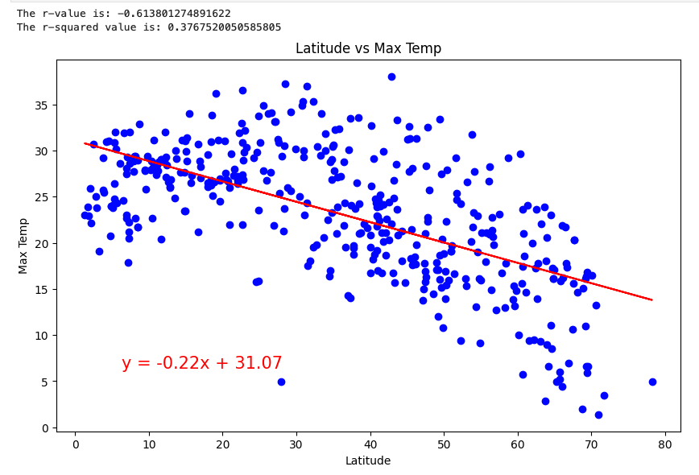

For Southern Hemisphere, there is a relatively strong positive correlation between temperature and latitude with a correlation coefficient of 0.7775599019517835.

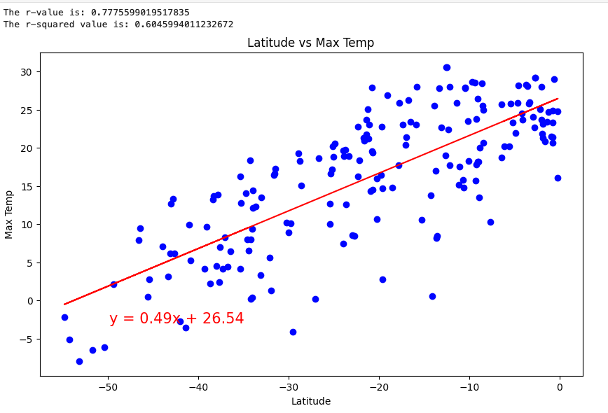

### Humidity vs. Latitude

For Northern Hemisphere, there is a very small negative correlation between humidity and latitude with a correlation coefficient of -0.13209272868817812, it almost indicates there is no correlation.

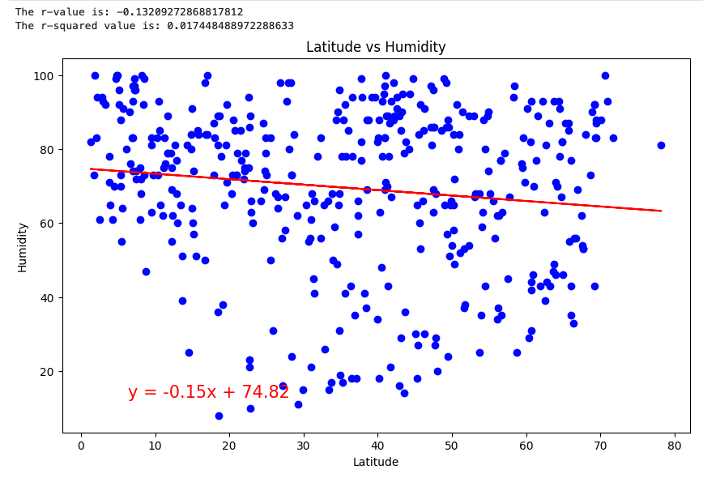

For Southern Hemisphere, there is a very small positive correlation between humidity and latitude with a correlation coefficient of 0.1357053089957225, it almost indicates there is no correlation.

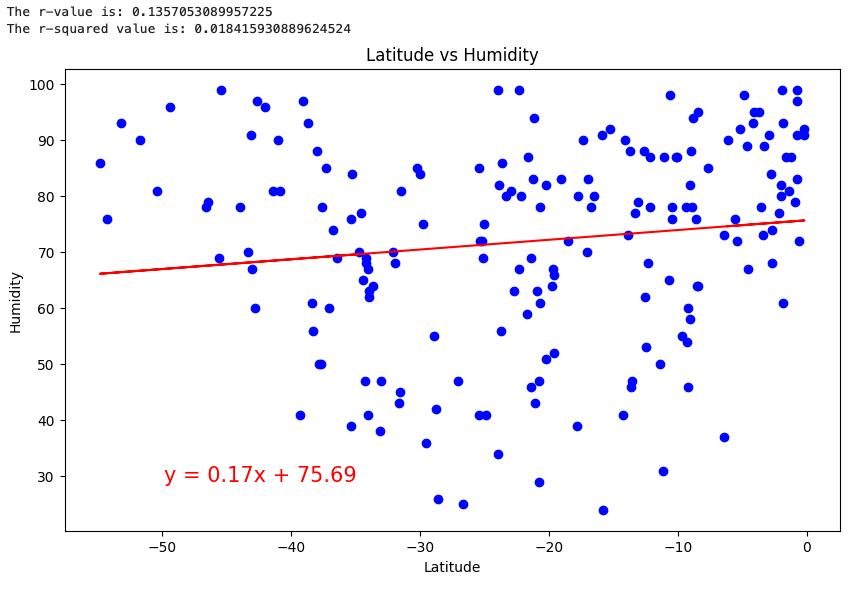

### Cloudiness vs. Latitude

For Northern Hemisphere, there is a very small negative correlation between cloudiness and latitude with a correlation coefficient of -0.1342156999984115, it almost indicates there is no correlation.

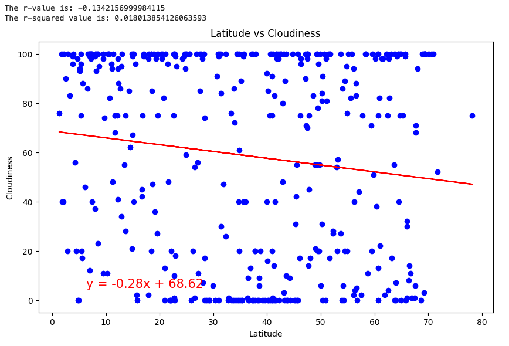

For Southern Hemisphere, there is a very small positive correlation between cloudiness and latitude with a correlation coefficient of 0.08270565798427507, it almost indicates there is no correlation.

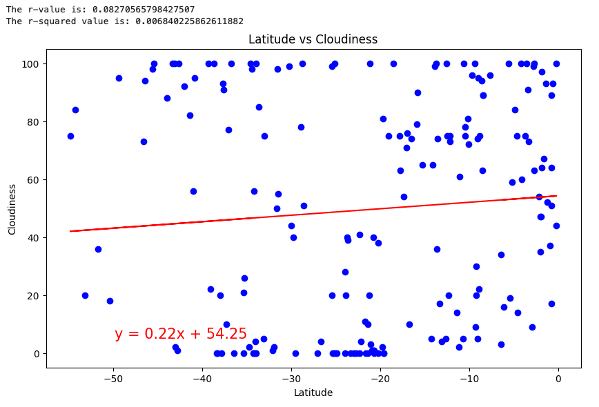

### Wind Speed vs. Latitude

For Northern Hemisphere, there is a very small negative correlation between wind speed and latitude with a correlation coefficient of -0.06290931832229797, it almost indicates there is no correlation.

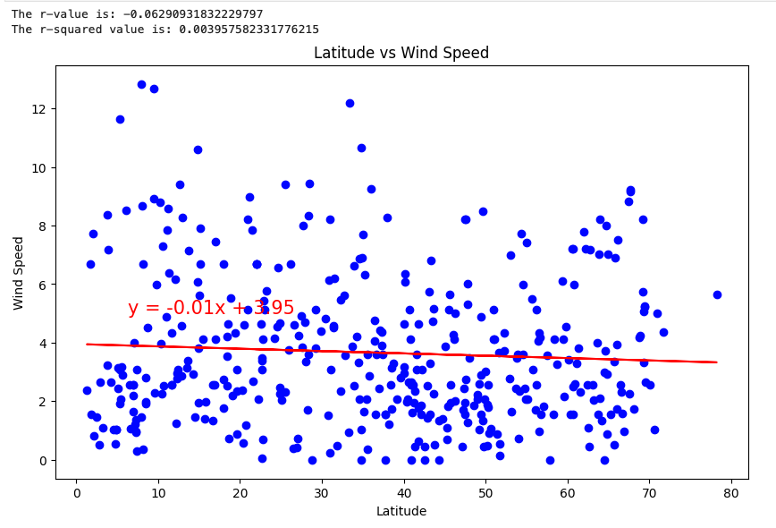

For Southern Hemisphere, there is a very small negative correlation between wind speed and latitude with a correlation coefficient of -0.09949286688750741, it almost indicates there is no correlation.

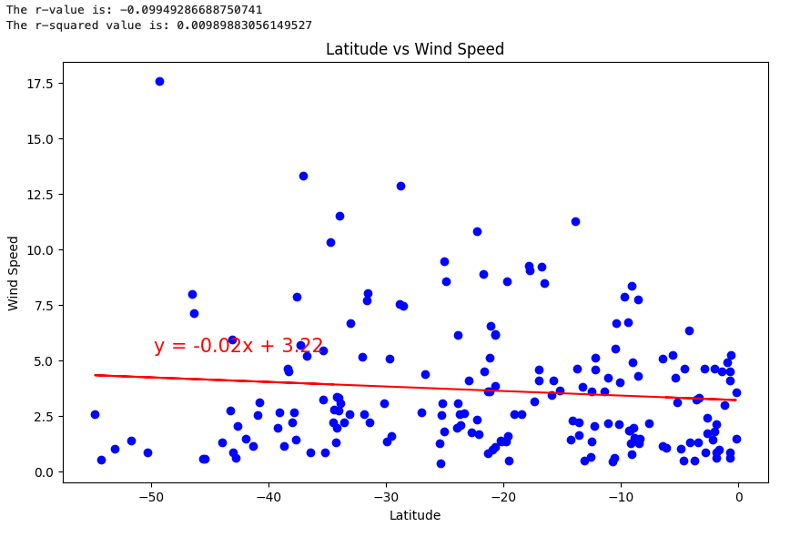

## VacationPy

Create city map that displays a point for every city in the city_data_df DataFrame using data in output_data/cities.csv. The size of the point is determined by the humidity level in each city.

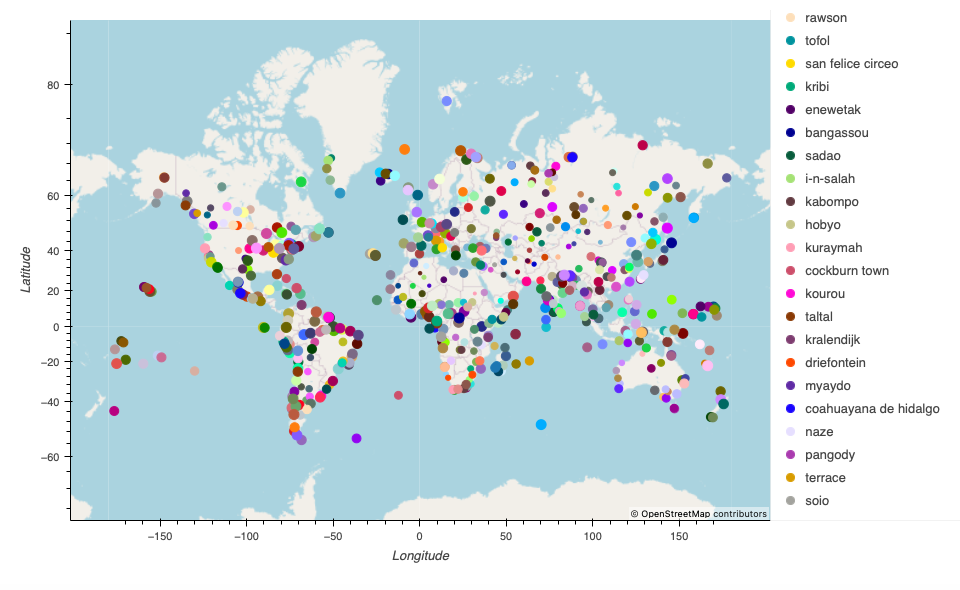

Narrow down cities that fit the criteria and drop any results with null values, the criteria are listed below:

* A max temperature lower than 27 degrees but higher than 21
* Wind speed less than 4.5 m/s
* Zero cloudiness

Create a new DataFrame called hotel_df which contains columns: City, Country, Lat, Lng, Humidity, and Hotel Name. For each city, use the Geoapify API to find the first hotel located within 10,000 metres of each city and append the results to hotel_df in a column called `Hotel Name'.

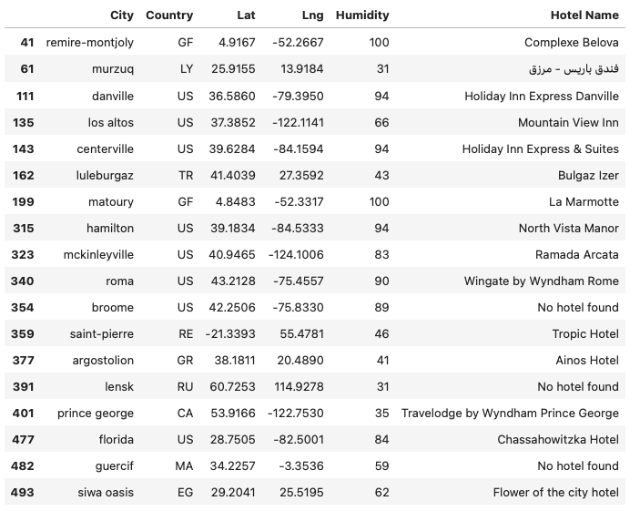

Add the hotel name and the country as additional information in the hover message for each city in hotel map
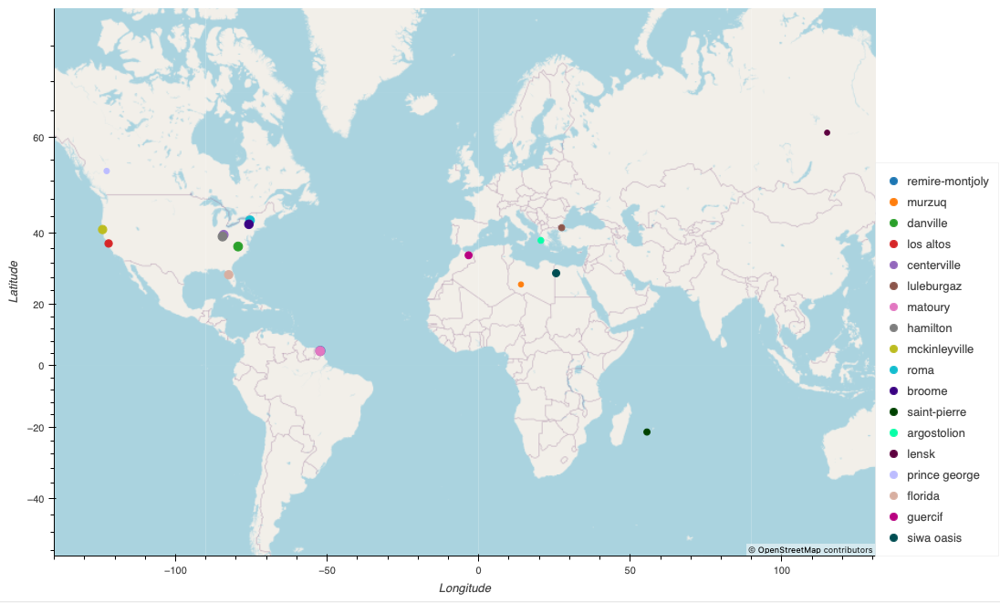